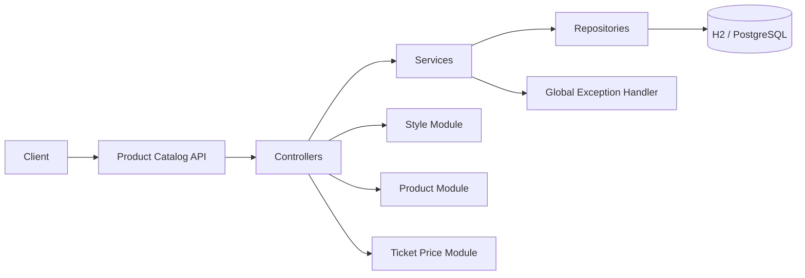
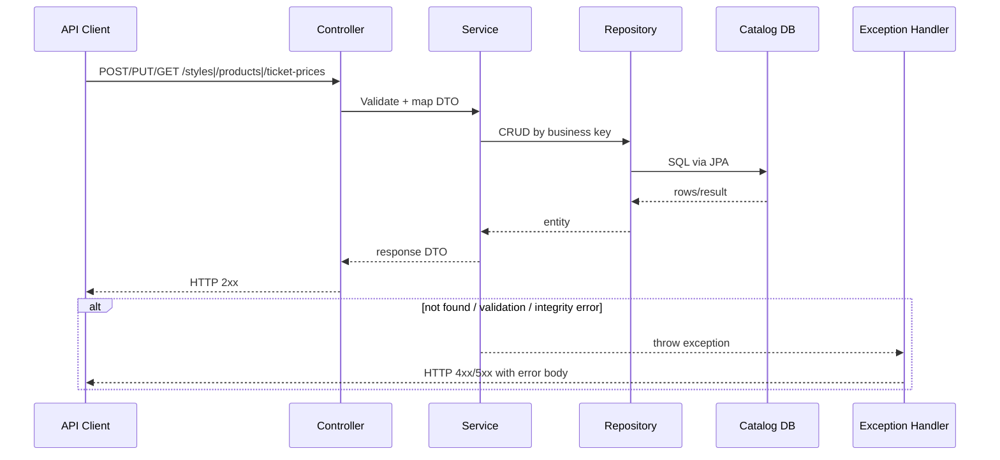
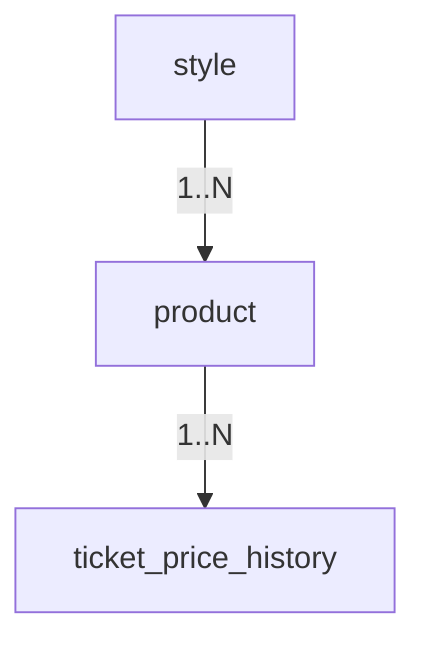

# Product Catalog Service

Spring Boot microservice for catalog operations: styles, products, and ticket price history.

## Service Scope
- Manage styles
- Manage products
- Manage time-phased ticket prices

## Tech Stack
- Java 25
- Spring Boot 4
- Spring Data JPA
- H2 / PostgreSQL
- OpenAPI (Swagger)

## Default Port
- `8081`

## Architecture Flow


## Sequence Diagram


## Database Schema
- `style`
- `product` (FK -> `style`)
- `ticket_price_history` (FK -> `product`, unique `product_id + effective_date`)

### ER Diagram


## Key APIs
- `GET /api/v1/styles`
- `GET /api/v1/styles/{styleId}`
- `POST /api/v1/styles`
- `PUT /api/v1/styles/{styleId}`
- `DELETE /api/v1/styles/{styleId}`
- `GET /api/v1/products`
- `GET /api/v1/products/{productId}`
- `POST /api/v1/products`
- `PUT /api/v1/products/{productId}`
- `DELETE /api/v1/products/{productId}`
- `GET /api/v1/ticket-prices`
- `GET /api/v1/ticket-prices/{productId}`
- `POST /api/v1/ticket-prices`
- `PUT /api/v1/ticket-prices/{productId}/{effectiveDate}`
- `DELETE /api/v1/ticket-prices/{productId}/{effectiveDate}`

## Build and Run
```bash
./gradlew clean build
./gradlew bootRun
```

Run with PostgreSQL profile:
```bash
./gradlew bootRun --args='--spring.profiles.active=postgres'
```

## API Docs
- Swagger: `http://localhost:8081/swagger-ui.html`
- OpenAPI: `http://localhost:8081/api-docs`
